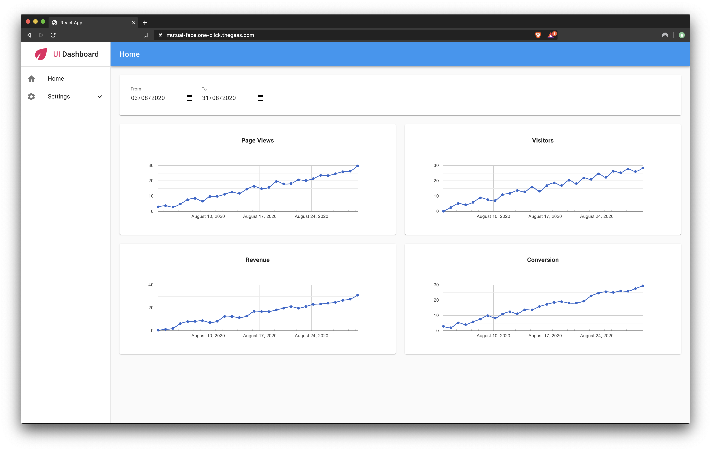
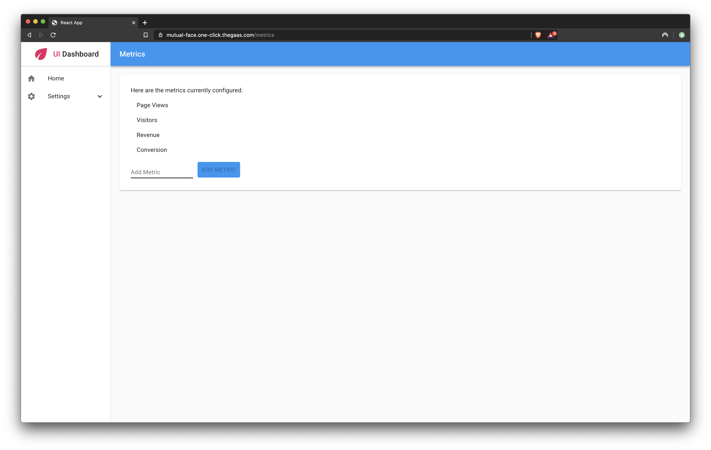

  <h1 align="center">Charts</h1>
  <h2 align="center">
    A One-Click Deployable App with 
     
    A fully-managed GraphQL backend service
  </h2>

<h3 align="center"><a href="https://dgraph.io/docs/learn/developer/todo-app-tutorial/todo-deploy/" target="_blank">Deploy Now</a> for free!</h3>

Charts is a sample app that lets users build online charts using metrics that they provide. For example, you could provide this app with data from an e-commerce site and use it to track site statistics such as the number of page views and revenue. This app demonstrates how to use React hooks with Apollo client to add and read related data. Deploying this app on Slash GraphQL deploys both the back-end database service and a front-end React app in a single click, no credit card required. To learn more about this sample app, see the [Charting Sample App on GitHub](https://github.com/dgraph-io/graphql-sample-apps/tree/master/charting).

### Features
- Create multiple metrics
- Data entry collection
- Plot metrics on line charts with controllable time period

### Front-end
- [React](https://reactjs.org/) (3.4.1)—a JavaScript library for building user interfaces.
- [Apollo Client](https://www.npmjs.com/package/apollo-client) (3.0+)—a comprehensive state management library for JavaScript that enables you to manage both local and remote data with GraphQL.
- [Material-UI](https://material-ui.com/)—a user interface framework for faster and easier web development.
- [React Google Charts](https://react-google-charts.com/)—a declarative API to make rendering charts fun and easy.

### Back-end
- [Slash GraphQL](https://dgraph.io/slash-graphql)—a fully managed GraphQL backend service

## Getting started

### No-Auth Version

1. Copy the entire contents of the `schema.graphql` file located in the root folder of the application.
2. Open your `Graphql Client`, you can check some GraphQL clients [here](https://dgraph.io/docs/graphql/quick-start/#testing-your-graphql-api) or open a `terminal` and run the following command: `curl -X POST localhost:8080/admin/schema --data-binary <@SCHEMA.GRAPHQL>`, which contains the code copied in step 1.
4. To run the application locally go to the `src` folder and find the `apollo-client.js` file and replace `uri: process.env.REACT_APP_GRAPHQL_ENDPOINT || "<API-ENDPOINT>"` by `uri: process.env.REACT_APP_GRAPHQL_ENDPOINT || "http://localhost:8080/graphql"`.
3. In the root folder of the application, open a terminal and run the following commands: `npm install` followed by `npm start`.

### Auth Version

1. Create an authentication service account on: [Auth0](https://auth0.com/).
2. After creating your Auth0 account, follow the instructions provided [here](https://dgraph.io/docs/learn/developer/todo-app-tutorial/todo-auth0-jwt/) to set up Auth0 authentication.
3. Open the `schema.graphql` file located in the root folder and apply the `rules` as described in step 2.
4. Then open your `Graphql Client`, you can check some GraphQL clients [here](https://dgraph.io/docs/graphql/quick-start/#testing-your-graphql-api) or open a ` terminal ` and run the following command: `curl -X POST localhost:8080/admin/schema --data-binary <@SCHEMA.GRAPHQL>`.
5. To run the application locally go to the `src` folder and find the `apollo-client.js` file and replace `uri: process.env.REACT_APP_GRAPHQL_ENDPOINT || "<API-ENDPOINT>"` by `uri: process.env.REACT_APP_GRAPHQL_ENDPOINT || "http://localhost:8080/graphql"`.
6. In the root folder of the application, open a terminal and run the following commands: `npm install` followed by `npm start`.

### Links
- [Deploy Now](https://dgraph.io/docs/learn/developer/todo-app-tutorial/todo-deploy/)
- [Community Support](https://discuss.dgraph.io/)

### Screenshots

