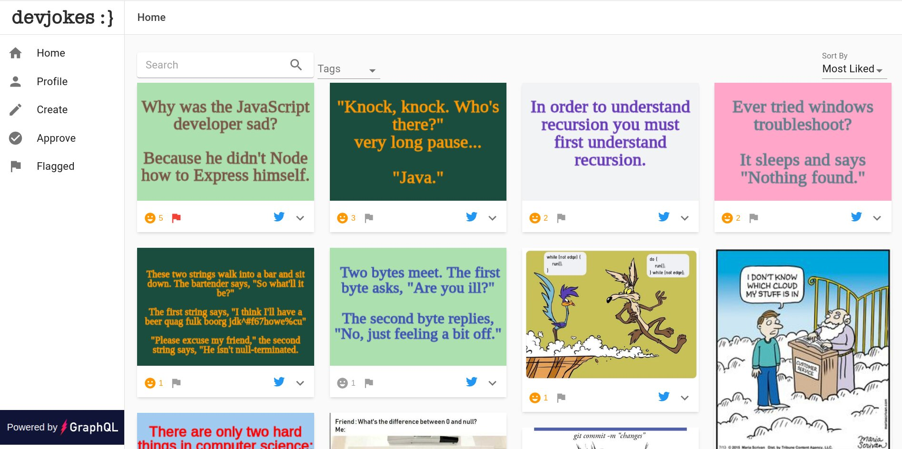
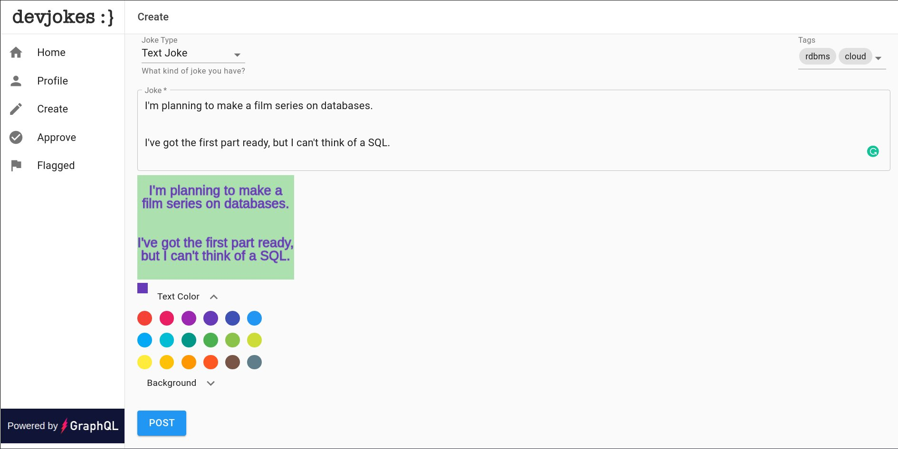
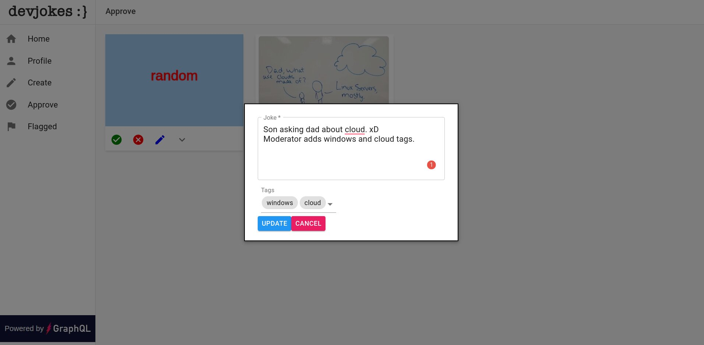

  <h1 align="center">DevJokes</h1>
  <h2 align="center">
    A One-Click Deployable App with 
     
    A fully-managed GraphQL backend service
  </h2>

<h3 align="center"><a href="https://slash.dgraph.io/_/one-click?app=dev-jokes" target="_blank">Deploy Now</a> for free!</h3>

DevJokes is a sample app that lets users find, like, and share their favorite geeky jokes with other software developers. This app demonstrates how to use React hooks with an Apollo client to create jokes, filter jokes by tags, add user reactions to jokes, and moderate jokes. Also demonstrated is the client side to uploading images to AWS S3 and storing links to the images. Deploying this app on Slash GraphQL deploys both the back-end database service and a front-end React app in a single click, no credit card required.  To learn more about this sample app, see: [Building a DevJoke Application with GraphQL](https://dgraph.io/blog/post/devjoke-intro/).

### Features
- Support two kind of jokes: Text Joke and Meme
- Moderated content to feed you the best jokes and add enable better searching.
- Logged in users can like and share the jokes.
- Community moderation enabled through flagging.

### Front-end
- [React](https://reactjs.org/) (3.4.3)—a JavaScript library for building user interfaces.
- [Apollo Client](https://www.npmjs.com/package/apollo-client) (3.0+)—a comprehensive state management library for JavaScript that enables you to manage both local and remote data with GraphQL.
- [Material-UI](https://material-ui.com/)—a user interface framework for faster and easier web development.
- [Emoji Mart](https://github.com/missive/emoji-mart)—a Slack-like customizable emoji picker component for React.
- [React Grid Gallery](https://benhowell.github.io/react-grid-gallery/)—a justified image gallery component for React inspired by Google Photos and based upon React Images.
- [React Share](https://github.com/nygardk/react-share)—social media share buttons and share counts for React.
- [React Markdown](https://github.com/remarkjs/react-markdown)—markdown component for React using remark.

### Back-end
- [Slash GraphQL](https://dgraph.io/slash-graphql)—a fully managed GraphQL backend service
- [Auth0](https://auth0.com/)—Secure access for everyone.
- [AWS-S3](https://aws.amazon.com/s3/)—an object storage service that offers industry-leading scalability, data availability, security, and performance.

### Links
- [Deploy Now](https://slash.dgraph.io/_/one-click?app=dev-jokes)
- [Blog: Building a DevJoke Application with GraphQL](https://dgraph.io/blog/post/devjoke-intro/)
- [Demo](https://devjokes.netlify.app/)
- [Community Support](https://discuss.dgraph.io/)

### Screenshots

