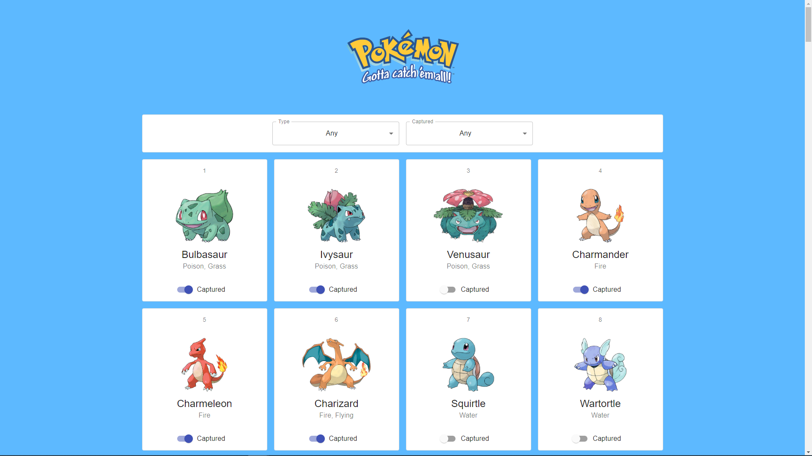

  <h1 align="center">Pokedex</h1>
  <h2 align="center">
    A One-Click Deployable App with 
     
    A fully-managed GraphQL backend service
  </h2>

<h3 align="center"><a href="https://cloud.dgraph.io/_/one-click?app=pokedex" target="_blank">Deploy Now</a> for free!</h3>

Pokedex is a sample app inspired by the [Pokedex](https://www.pokemon.com/us/pokedex/) website. This sample app lets users search for Pokemon by type, weakness, ability, and more! This app demonstrates how to filter Pokemon by tags and update a captured status. Deploying this app on Slash GraphQL deploys both the back-end database service and a front-end React app in a single click, no credit card required. To learn more, see [Pokedex on GitHub](https://github.com/dgraph-io/graphql-sample-apps/tree/master/pokedex).

### Features
- Filter Pokemon by type
- Mark Pokemon as Captured
- Filter Pokemon by Captured

### Front-end
- [React](https://reactjs.org/) (3.4.3)—a JavaScript library for building user interfaces.
- [Material-UI](https://material-ui.com/)—a user interface framework for faster and easier web development.

### Back-end
- [Dgraph Cloud](https://cloud.dgraph.io/slash-graphql)—a fully managed GraphQL backend service

### Links
- [Deploy Now](https://cloud.dgraph.io/_/one-click?app=pokedex)
- [External Blog: How to Build a Pokeacutedex React App with a Slash](https://dzone.com/articles/how-to-build-a-pokeacutedex-react-app-with-a-slash)
- [Demo](http://tylerhawkins.info/pokedex-slash-graphql/build/)
- [Community Support](https://discuss.dgraph.io/)

### Screenshots

---
