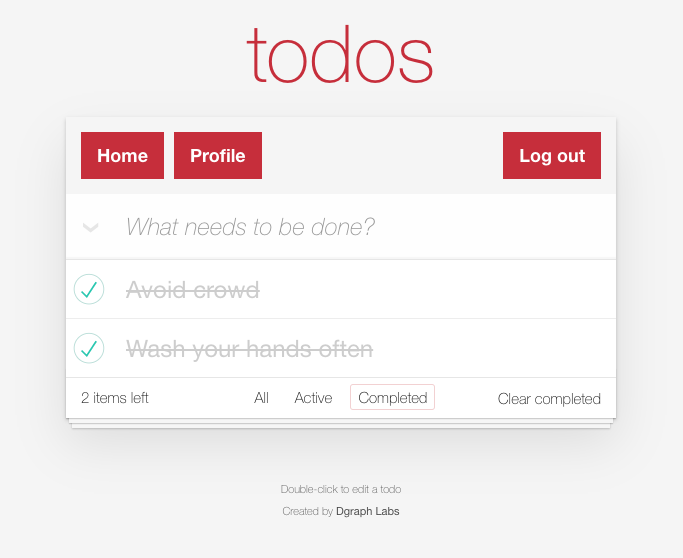

  <h1 align="center">ToDo React App</h1>
  <h2 align="center">
    A One-Click Deployable App with 
     
    A fully managed GraphQL backend service
  </h2>

<h3 align="center"><a href="https://slash.dgraph.io/_/one-click?app=todo" target="_blank">Deploy Now</a> for free!</h3>

To-Do is a sample app that lets uers manage the tasks on their personal to-do list. Developers can see how to use react hooks with apollo client to easily create, read, update, and delete To-Do items. Deploying this app on Slash deploys both the back-end database service and a front-end react app in a single click, no credit card required. To learn more about this sample app, see: [Building a To-Do List React App with Dgraph](https://dgraph.io/blog/post/building-todo-list-react-dgraph/)

### Features
- Add a new task
- Update an existing task to mark tasks completed
- Delete existing tasks

### Front-end
- [React](https://reactjs.org/) (3.4.0)—a JavaScript library for building user interfaces.
- [Mobx](https://mobx.js.org/README.html)— MobX is a battle tested library that makes state management simple and scalable by transparently applying functional reactive programming (TFRP).
- [Apollo Client](https://www.npmjs.com/package/apollo-client) (2.6.8)—a comprehensive state management library for JavaScript that enables you to manage both local and remote data with GraphQL.
- [ToDoMVC app CSS](https://github.com/tastejs/todomvc-app-css)—CSS for a ToDo App
- [React Router](https://reactrouter.com/)—a collection of navigational components
- [clipboard.js](https://clipboardjs.com/)—a modern approach to copy text to clipboard 
- [history](https://github.com/ReactTraining/history)—lets you easily manage session history

### Back-end
- [Slash GraphQL](https://dgraph.io/slash-graphql)—a fully managed GraphQL backend service
- [Auth0](https://auth0.com/)—Secure access for everyone.

### Links
- [Deploy Now](https://slash.dgraph.io/_/one-click?app=todo)
- [Blog: Build a React app with Slash GraphQL](https://dgraph.io/blog/post/todo-slash-graphql/)
- [Demo](https://slash-graphql-todos.netlify.app/)
- [Community Support](https://discuss.dgraph.io/)

### Screenshots

---
