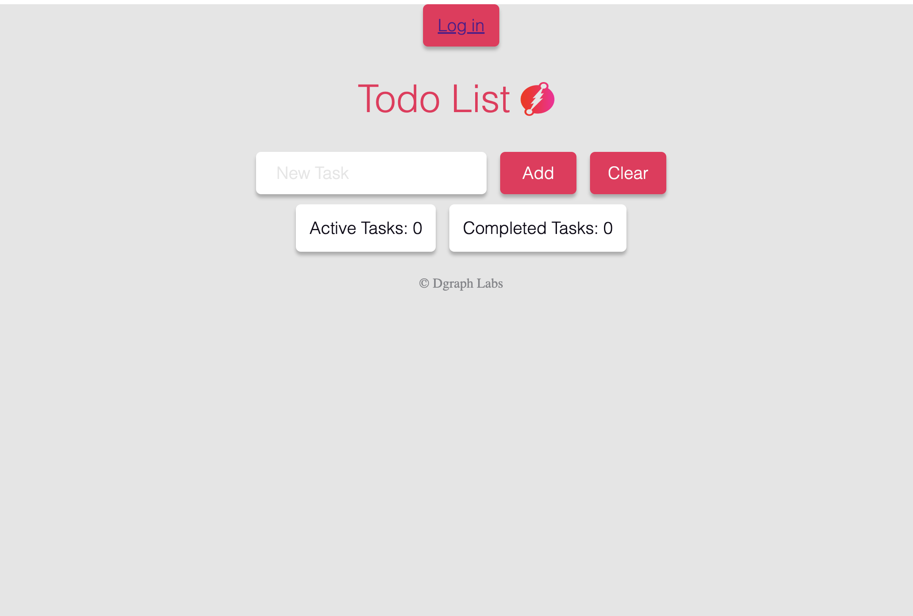
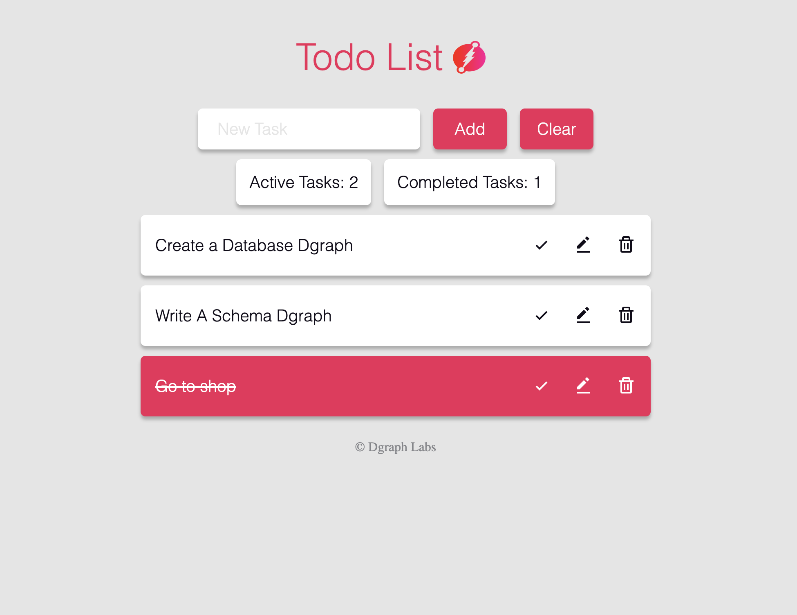

### React + Vite

This template provides a minimal setup to get React working in Vite with HMR and some ESLint rules.

Currently, two official plugins are available:

- [@vitejs/plugin-react](https://github.com/vitejs/vite-plugin-react/blob/main/packages/plugin-react/README.md) uses [Babel](https://babeljs.io/) for Fast Refresh
- [@vitejs/plugin-react-swc](https://github.com/vitejs/vite-plugin-react-swc) uses [SWC](https://swc.rs/) for Fast Refresh

  <h1 align="center">ToDo React App</h1>
  <h2 align="center">
     
    A fully-managed GraphQL backend service
  </h2>

<h3 align="center"><a href="https://dgraph.io/docs/learn/developer/todo-app-tutorial/todo-deploy/" target="_blank">Deploy Now</a> for free!</h3>

To-Do is a sample app that lets users manage the tasks on their personal to-do list. This app demonstrates how to use React hooks with an Apollo client to easily create, read, update, and delete to-do list items. Deploying this app on Slash GraphQL deploys both the back-end database service and a front-end React app in a single click, no credit card required. To learn more about this sample app, see: [Building a To-Do List React App with Dgraph](https://dgraph.io/blog/post/building-todo-list-react-dgraph/)

### Features
- Add a new task
- Update an existing task to mark tasks completed
- Edit tasks
- Delete existing tasks

### Front-end
- [React](https://reactjs.org/) (3.4.0)—a JavaScript library for building user interfaces.
- [Vite](https://vitejs.dev/guide/)— vite is an amazing tool to speed up your frontend development workflow. Try it now and experience faster and more efficient development.
- [Apollo Client](https://www.npmjs.com/package/@apollo/client) (3.x)—a comprehensive state management library for JavaScript that enables you to manage both local and remote data with GraphQL.
- [React-Toastify](https://fkhadra.github.io/react-toastify/introduction) Toastify React, a handy library for displaying attractive and customizable toast notifications in your React applications.

### Back-end
- [GraphQL API](https://dgraph.io/docs/graphql)—a fully managed GraphQL backend service
- [Auth0](https://auth0.com/)—Secure access for everyone.

### Links
- [Deploy Now](https://dgraph.io/docs/learn/developer/todo-app-tutorial/todo-deploy/)
- [Blog: Build a React app with Slash GraphQL](https://dgraph.io/blog/post/todo-slash-graphql/) Old Version
- [Community Support](https://discuss.dgraph.io/)

### Screenshots

---