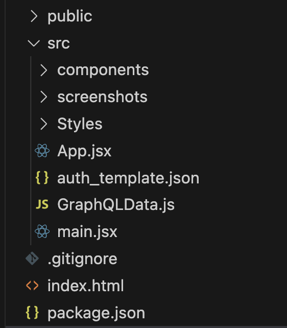
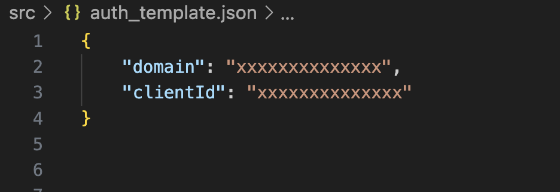

### React + Vite

This template provides a minimal setup to get React working in Vite with HMR and some ESLint rules.

Currently, two official plugins are available:

- [@vitejs/plugin-react](https://github.com/vitejs/vite-plugin-react/blob/main/packages/plugin-react/README.md) uses [Babel](https://babeljs.io/) for Fast Refresh
- [@vitejs/plugin-react-swc](https://github.com/vitejs/vite-plugin-react-swc) uses [SWC](https://swc.rs/) for Fast Refresh

  <h1 align="center">ToDo React App</h1>
  <h2 align="center">
     
    A fully-managed GraphQL backend service
  </h2>

<h3 align="center"><a href="https://dgraph.io/docs/learn/developer/todo-app-tutorial/todo-deploy/" target="_blank">Deploy Now</a> for free!</h3>

To-Do is a sample app that lets users manage the tasks on their personal to-do list. This app demonstrates how to use React hooks with an Apollo client to easily create, read, update, and delete to-do list items. Deploying this app on Slash GraphQL deploys both the back-end database service and a front-end React app in a single click, no credit card required. To learn more about this sample app, see: [Building a To-Do List React App with Dgraph](https://dgraph.io/blog/post/building-todo-list-react-dgraph/)

### Features
- Add a new task
- Update an existing task to mark tasks completed
- Edit tasks
- Delete existing tasks

### Front-end
- [React](https://reactjs.org/) (3.4.0)—a JavaScript library for building user interfaces.
- [Vite](https://vitejs.dev/guide/)— vite is an amazing tool to speed up your frontend development workflow. Try it now and experience faster and more efficient development.
- [Apollo Client](https://www.npmjs.com/package/@apollo/client) (3.x)—a comprehensive state management library for JavaScript that enables you to manage both local and remote data with GraphQL.
- [React-Toastify](https://fkhadra.github.io/react-toastify/introduction) Toastify React, a handy library for displaying attractive and customizable toast notifications in your React applications.

### Back-end
- [Dgraph Cloud](https://cloud.dgraph.io/)—a fully managed GraphQL backend service.
- [Using Auth0](https://dgraph.io/docs/learn/developer/todo-app-tutorial/todo-auth0-jwt/)—how to use auth0. 
- [Auth0](https://auth0.com/)—Secure access for everyone.

## Getting started

### No-Auth Version

1. Copy the entire contents of the `schema_noauth.graphql` file located in the root folder of the application.
2. Open your `Graphql Client`, you can check some GraphQL clients [here](https://dgraph.io/docs/graphql/quick-start/#testing-your-graphql-api) or open a `terminal` and run the following command: `curl -X POST localhost:8080/admin/schema --data-binary <@SCHEMA_NOAUTH.GRAPHQL>`, which contains the code copied in step 1.
3. To run the application locally locate the `main.jsx` file in the application `src` folder and then locate the constant called `GRAPHQL_ENDPOINT` and change the value to `http://localhost:8080/graphql`.
4. In the root folder of the application, open a terminal and run the following commands: `yarn` followed by `yarn dev`.

### Auth Version

1. Copy the entire contents of the `schema.graphql` file located in the root folder of the application.
2. Open your `Graphql Client`, you can check some GraphQL clients [here](https://dgraph.io/docs/graphql/quick-start/#testing-your-graphql-api) or open a `terminal` and run the following command: `curl -X POST localhost:8080/admin/schema --data-binary <@SCHEMA.GRAPHQL>`, which contains the code copied in step 1.
3. Create an authentication service account on: [Auth0](https://auth0.com/).
4. After creating your Auth0 account, follow the instructions provided [here](https://dgraph.io/docs/learn/developer/todo-app-tutorial/todo-auth0-jwt/) to set up Auth0 authentication. 
5. In the root folder of the application, open a terminal and run the following commands: `yarn` followed by `yarn dev`.

### Note
To run the application after cloning the repository, you must create a file called `auth_template.json` inside the `src` folder and place your auth0 credentials in the file as shown in the following image:

The file should look like this:

### Links
- [Deploy Now](https://dgraph.io/docs/learn/developer/todo-app-tutorial/todo-deploy/)
- [Blog: Build a React app with Slash GraphQL](https://dgraph.io/blog/post/todo-slash-graphql/) Old Version
- [Community Support](https://discuss.dgraph.io/)

### Screenshots

---