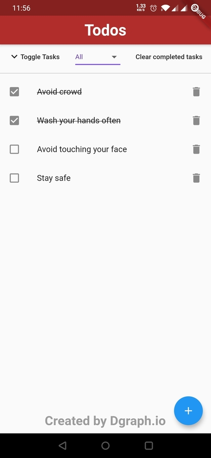
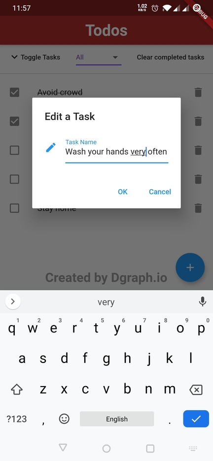

# fluttertodoapp

Flutter GraphQL Todo application powered by Dgraph.

### GraphQL Schema for Dgraph

At first, when we visualize the main components of Todo App, we get node as shown below:


Equivalent GraphQL schema for the graph above would be as follow:

```graphql
type Task {
    ...
}
```

So what do you think we should have for a Task node?

We have mainly a title and a status to check if the Task was completed.
We represent that in the GraphQL schema shown below:

```graphql
type Task {
    id: ID!
    title: String!
    completed: Boolean!
}
```

_Note: You will be required to add custom directives to support additional functionalities of Dgraph._

### Set Up the Environment

Before we begin, make sure that you have [Docker](https://docs.docker.com/install/)
installed on your machine.

Let's begin by starting Dgraph standalone by running the command below:

```bash
docker run --rm -it -p 8080:8080 -v ~/dgraph:/dgraph dgraph/standalone:v20.03.1
```

Save the content below as `schema.graphql`.

```graphql
type Task {
    id: ID!
    title: String! @search(by: [fulltext])
    completed: Boolean! @search
}
```

Let's load up the GraphQL schema file to Dgraph:

```sh
curl -X POST localhost:8080/admin/schema --data-binary '@schema.graphql'
```

If you’ve followed the steps above correctly, there’s a GraphQL server up and running.
You can access that GraphQL endpoint with any of the great GraphQL developer tools.
Good choices include GraphQL Playground, Insomnia, GraphiQL and Altair.

Set up any of them and point it at `http://localhost:8080/graphql`.
If you know lots about GraphQL, you might want to explore the schema, queries and
mutations that were generated from the input.

## Project setup

Make sure you have the complete setup done for [Flutter](https://flutter.dev/docs/get-started/install)
and other dependencies.

Clone this repository and open the project using your preferred editors among VS Code and Android Studio.
After installing required dependencies, you should be able to build and run the project.

## Screenshots





